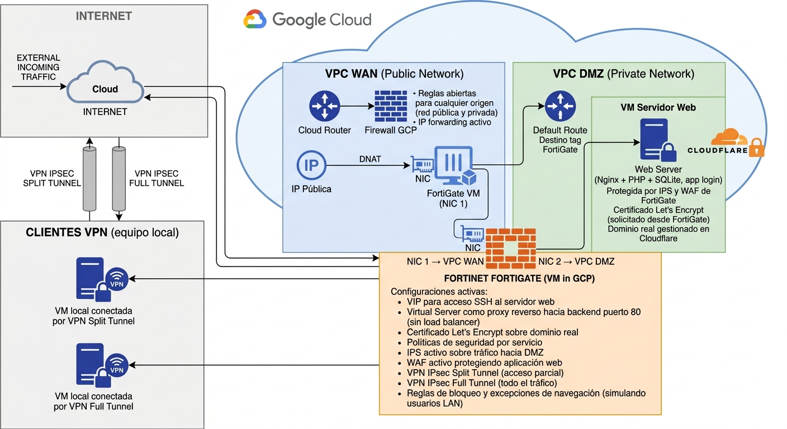

# Laboratorio-Fortinet-GCP
Laboratorio ciberseguridad 

# Lab: FortiGate en GCP — Práctica con Licencia Real

## Objetivo
Laboratorio técnico para el estudio y práctica de FortiGate 
en entorno cloud, utilizando licencia real en GCP.
No representa una arquitectura de producción optimizada.

## Stack
- FortiGate VM (GCP) — licencia real
- Google Cloud Platform (2 VPCs)
- Nginx + PHP + SQLite (app web de prueba)
- Cloudflare (DNS + dominio real)
- Kali Linux (simulación de ataques)

## Qué se practica en este lab

### Configuraciones FortiGate implementadas:
- VIP (acceso SSH a servidor en DMZ)
- Virtual Server como proxy reverso (puerto 80/443)
- Certificado Let's Encrypt solicitado desde FortiGate
- Políticas de seguridad por servicio
- IPS sobre tráfico hacia DMZ
- WAF protegiendo aplicación web
- VPN IPSec Split Tunnel
- VPN IPSec Full Tunnel
- Reglas de bloqueo y excepciones de navegación

## Diagrama

## Nota
Este laboratorio tiene fines de estudio técnico.
La arquitectura está simplificada para maximizar 
la práctica con FortiGate — no sigue todas las 
buenas prácticas de producción.
