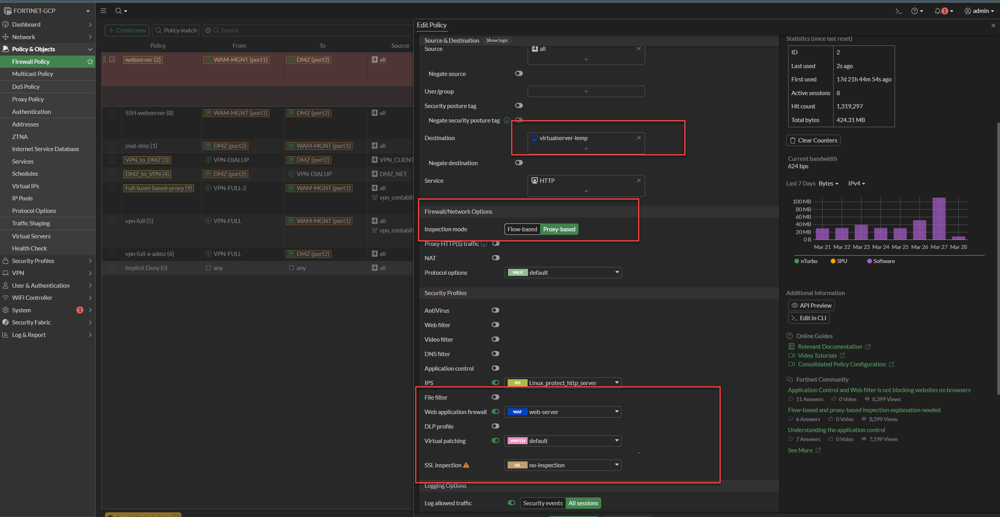
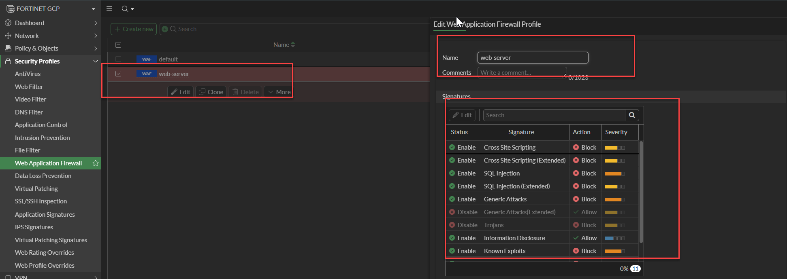
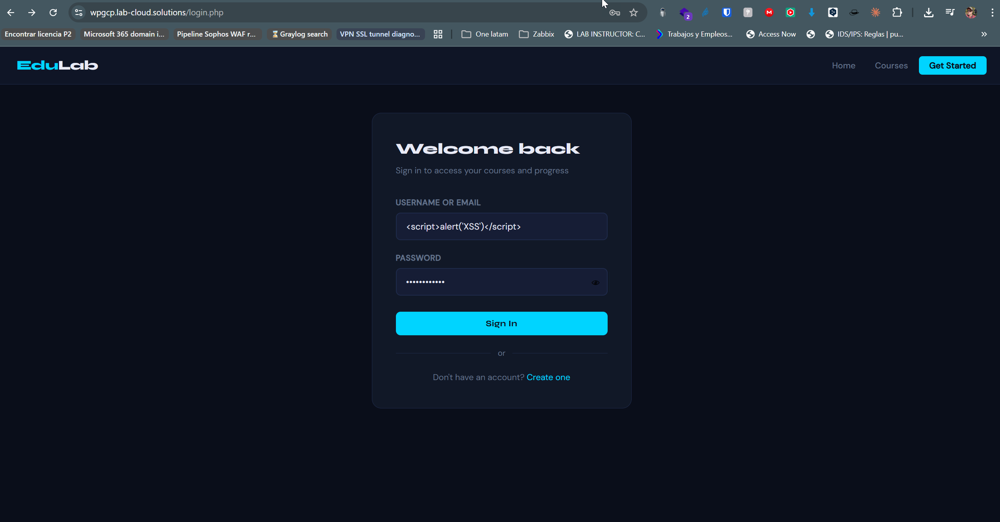
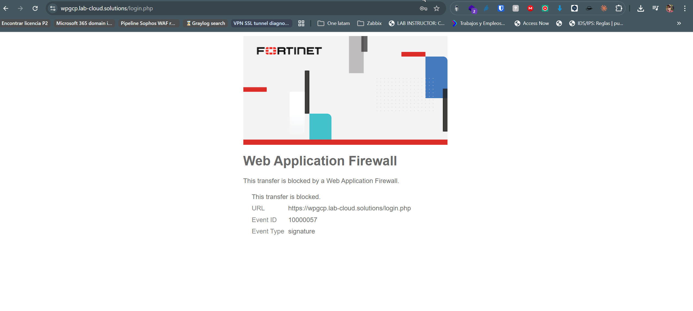
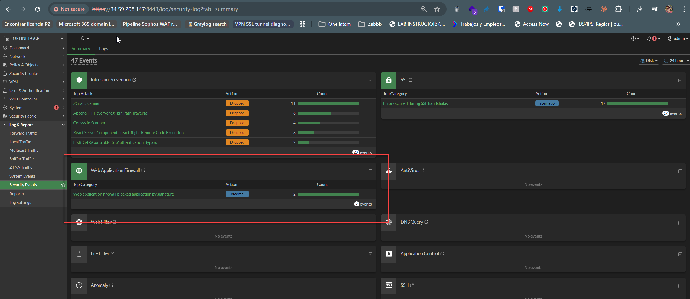
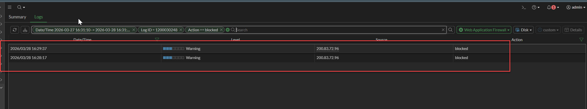
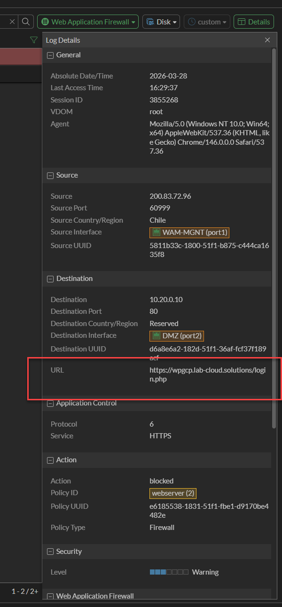
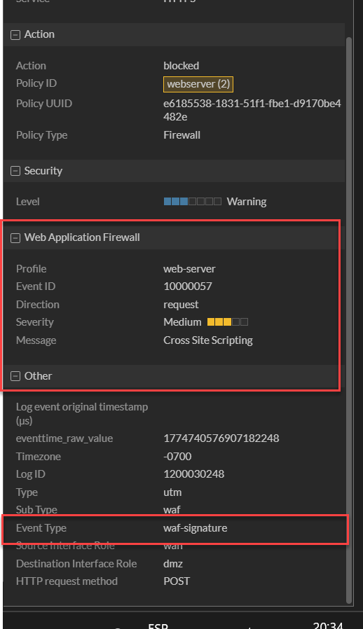

# Lab 1 — WAF: Detección y Bloqueo de XSS con FortiGate en GCP

## Objetivo

Demostrar que el WAF de FortiGate detecta y bloquea un ataque Cross-Site Scripting (XSS)
dirigido al formulario de login de la aplicación web EduLab Academy, desplegada en la DMZ de GCP.

## Mapeo MITRE ATT&CK

| Táctica | Técnica | ID |
|---|---|---|
| Initial Access | Exploit Public-Facing Application | T1190 |
| Execution | Command and Scripting Interpreter: JavaScript | T1059.007 |

# Diagrama

# Configuracion Policy

La politica webserver (2) controla el trafico desde WAM-MGNT (port1) hacia DMZ (port2). Tiene inspeccion en modo proxy-based, IPS activo con el perfil Linux_protect_http_server, y WAF activo con el perfil web-server. SSL Inspection configurado como no-inspection porque el certificado TLS lo termina FortiGate via Virtual Server.

# Configuraion WAF

# Configuraion WAF

El perfil web-server tiene habilitadas las firmas criticas con accion Block. Cross Site Scripting y XSS Extended cubren el vector usado en este lab. SQL Injection, Generic Attacks, Information Disclosure y Known Exploits completan la cobertura OWASP.

 

## Infraestructura involucrada

| Componente | Detalle |
|---|---|
| Atacante | Equipo externo, IP pública (Chile) |
| Firewall | FortiGate VM en GCP |
| Aplicación objetivo | EduLab Academy — PHP/SQLite, desplegada en VPC DMZ |
| Protección activa | WAF profile `web-server` aplicado en política `webserver (2)` |
| Flujo de tráfico | Internet → VPC WAN (port1) → FortiGate → VPC DMZ (port2) → 10.20.0.10:80 |

## Descripción del ataque

El payload XSS clásico `` fue ingresado en el campo
**USERNAME OR EMAIL** del formulario de login de la aplicación y enviado vía POST.

El objetivo es verificar si el WAF intercepta el payload antes de que llegue al servidor web.

## Ejecución

### Paso 1 — Ingreso del payload en el formulario

El payload fue ingresado directamente en el campo de usuario del formulario `login.php`.

### Paso 2 — Respuesta del WAF

Al enviar el formulario, FortiGate interceptó la request y retornó la página de bloqueo
del WAF en lugar de procesar el login.

Datos visibles en la página de bloqueo:
- **URL:** `https://wpgcp.lab-cloud.solutions/login.php`
- **Event ID:** 10000057
- **Event Type:** signature

## Evidencia en FortiGate

### Security Events — Resumen

En el panel `Log & Report → Security Events`, la sección **Web Application Firewall**
registró 2 eventos con acción **Blocked** durante la ventana de tiempo del ataque.

### WAF Logs — Vista filtrada

Filtro aplicado: `Action == blocked` + `Log ID = 1200030248` + rango horario del ataque.

Se registraron dos eventos bloqueados desde la IP de origen `200.83.72.96` (Chile):
- `2026/03/28 16:29:37` — blocked
- `2026/03/28 16:28:17` — blocked

### Detalle del log — Source / Destination / URL

| Campo | Valor |
|---|---|
| Source IP | 200.83.72.96 |
| Source Port | 60999 |
| Source Country | Chile |
| Source Interface | WAM-MGNT (port1) |
| Destination IP | 10.20.0.10 |
| Destination Port | 80 |
| Destination Interface | DMZ (port2) |
| URL | https://wpgcp.lab-cloud.solutions/login.php |
| Policy ID | webserver (2) |
| Action | blocked |

### Detalle del log — Sección WAF

| Campo | Valor |
|---|---|
| WAF Profile | web-server |
| Event ID | 10000057 |
| Direction | request |
| Severity | Medium |
| Message | Cross Site Scripting |
| Event Type | waf-signature |
| HTTP Method | POST |

## Análisis

El WAF de FortiGate identificó el payload mediante la firma `waf-signature` con Event ID
`10000057`, correspondiente a la categoría **Cross Site Scripting**. La request fue
bloqueada antes de llegar al servidor web en la DMZ.

Puntos relevantes:
- El bloqueo ocurrió sobre tráfico HTTPS entrante desde internet (WAN → DMZ)
- La política `webserver (2)` tiene el perfil WAF `web-server` activo con inspección por firma
- El servidor web en `10.20.0.10` nunca recibió el payload
- El campo username fue suficiente para disparar la firma — no fue necesario bypassear autenticación

## Conclusión

El WAF de FortiGate bloqueó correctamente el intento de XSS reflejado antes de que el
payload alcanzara la aplicación. Esto valida que la política de seguridad `webserver (2)`
con el perfil WAF activo cumple su función como control defensivo para aplicaciones web
expuestas en la DMZ.
