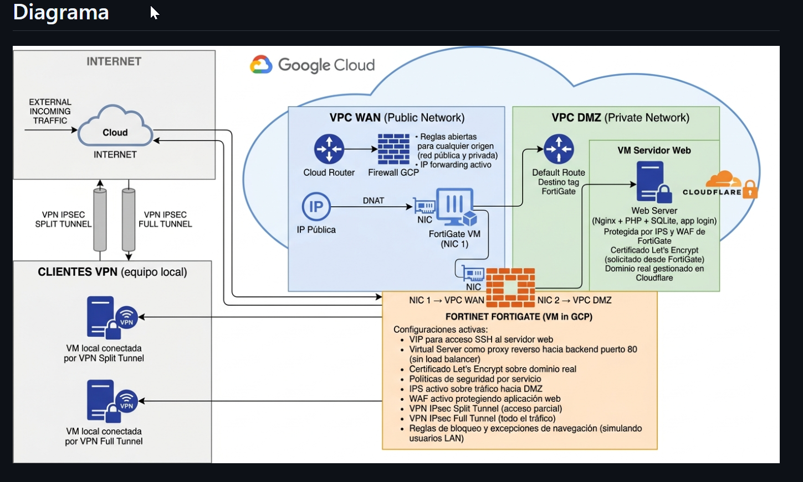
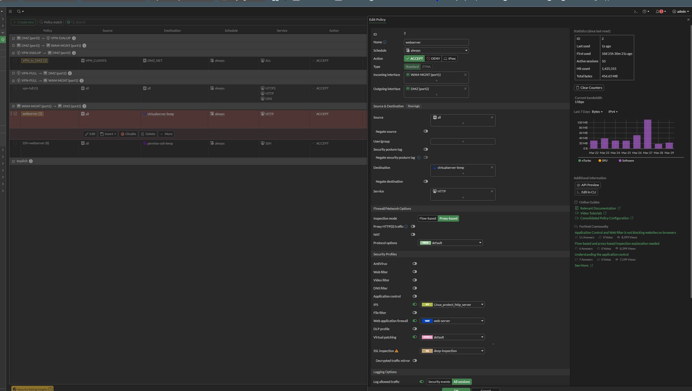
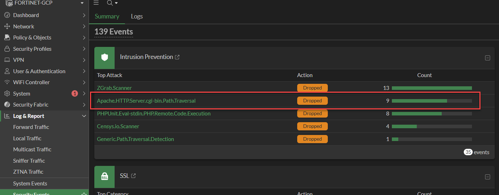
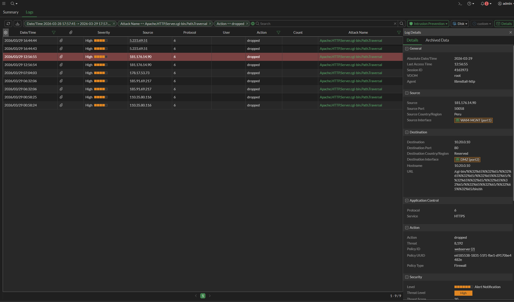
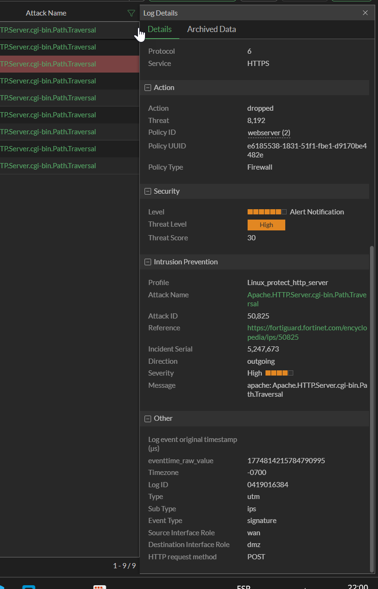
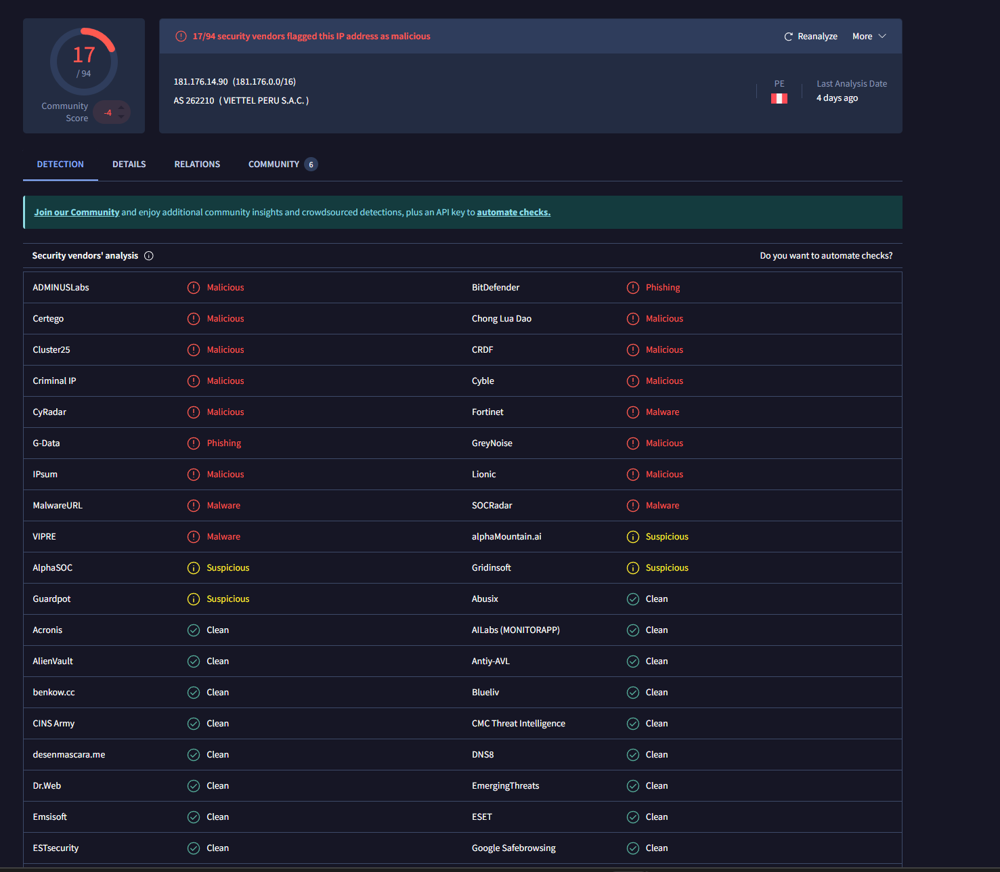
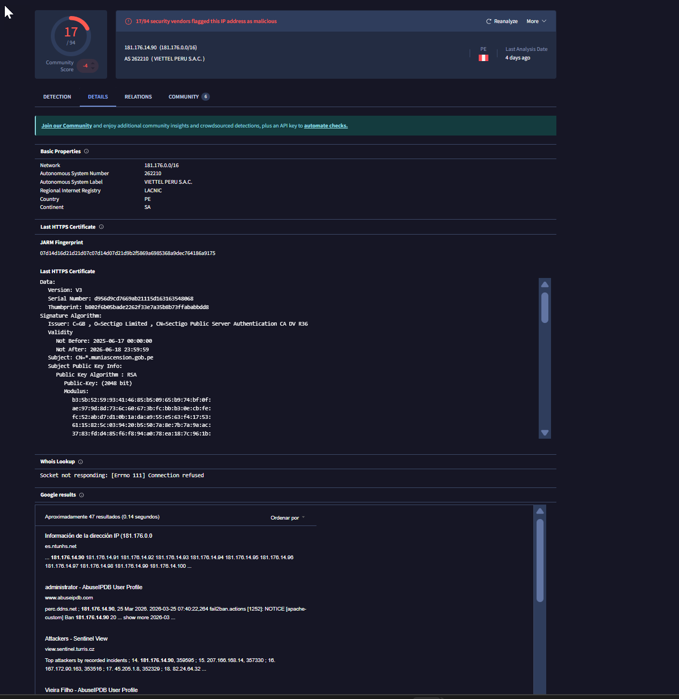
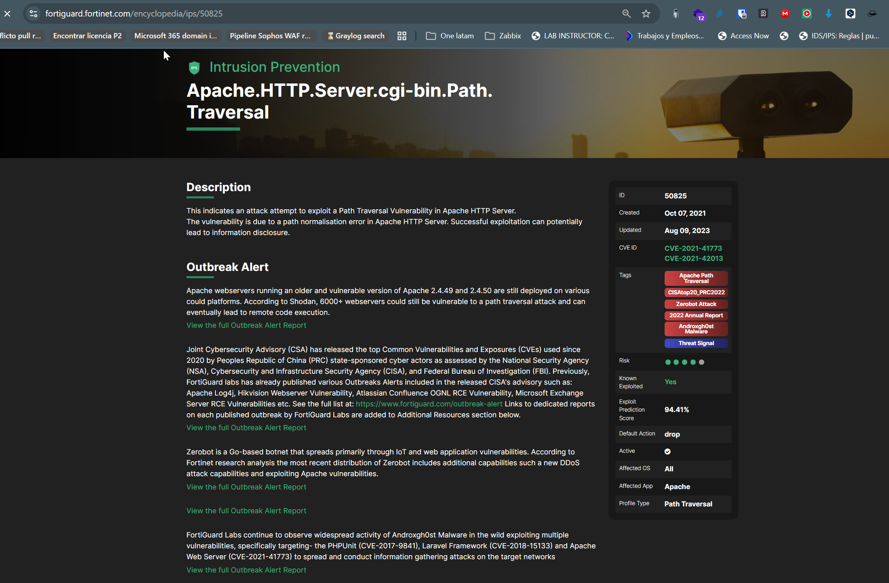
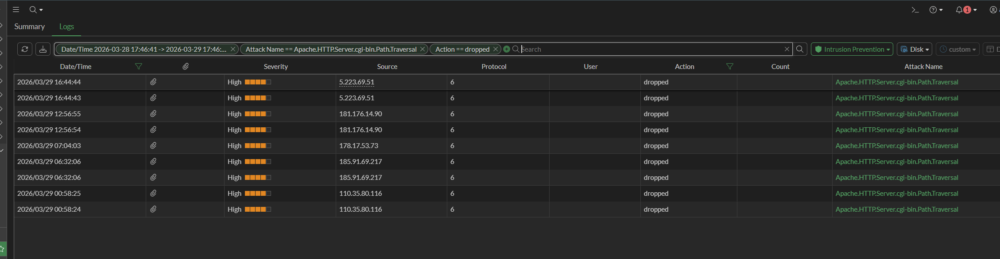
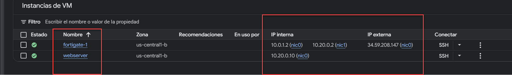

# Lab 2 — IPS: Detección y Bloqueo de Ataques Reales contra DMZ

## Objetivo

Este lab muestra cómo el IPS de FortiGate detecta y bloquea ataques reales
provenientes de internet hacia el servidor web en la DMZ. A diferencia de un
laboratorio simulado, el tráfico analizado es malicioso real — actores externos
que escanearon y atacaron la IP pública del laboratorio durante su operación normal.

## Contexto

El servidor web en 10.20.0.10 (VPC DMZ) está expuesto a internet a través de
FortiGate con IP pública 34.59.208.147. Durante las pruebas del laboratorio,
FortiGate registró 139 eventos de seguridad, de los cuales 35 corresponden
al IPS bloqueando intentos reales de explotación.

Este lab se enfoca en dos ataques de mayor relevancia:

- **Apache.HTTPServer.cgi-bin.Path.Traversal** — severidad High, 9 eventos
- **PHPUnit.Eval-stdin.PHP.Remote.Code.Execution** — severidad Critical, 8 eventos

## Mapeo MITRE ATT&CK

| Táctica | Técnica | ID |
|---|---|---|
| Initial Access | Exploit Public-Facing Application | T1190 |
| Discovery | Network Service Discovery | T1046 |
| Reconnaissance | Active Scanning | T1595 |

## Infraestructura involucrada

| Componente | Detalle |
|---|---|
| FortiGate VM | GCP us-central1-b, IP pública 34.59.208.147 |
| NIC1 (port1) | VPC WAN — recibe tráfico de internet |
| NIC2 (port2) | VPC DMZ — conecta al servidor web |
| Servidor web | 10.20.0.10, Nginx + PHP + SQLite |
| Perfil IPS activo | Linux_protect_http_server |
| Política aplicada | webserver (2) — WAM-MGNT → DMZ |

## Diagrama de arquitectura

El tráfico malicioso ingresa por la IP pública de GCP, es recibido por FortiGate
en NIC1 (VPC WAN) e inspeccionado por el IPS antes de llegar al servidor web en VPC DMZ.

## Configuración FortiGate — Política webserver (2)

La política `webserver (2)` controla todo el tráfico entrante desde WAM-MGNT (port1)
hacia DMZ (port2). Tiene IPS activo con el perfil `Linux_protect_http_server`,
WAF activo con perfil `web-server`, modo proxy-based y SSL deep-inspection.
Es la política que interceptó todos los ataques documentados en este lab.

---

## Ataque 1 — Apache HTTP Server cgi-bin Path Traversal

### Descripción técnica

El atacante intenta explotar una vulnerabilidad de path traversal en Apache HTTP Server
enviando requests con secuencias `../` codificadas en la URL para acceder a archivos
fuera del directorio web. En caso de éxito, puede leer archivos del sistema operativo
o ejecutar comandos arbitrarios.

| Campo | Valor |
|---|---|
| CVE | CVE-2021-41773, CVE-2021-42013 |
| Attack ID FortiGuard | 50825 |
| Severidad | High |
| Exploit Prediction Score | 94.41% |
| Known Exploited | Sí |
| Default Action | drop |
| Aplicaciones afectadas | Apache 2.4.49, 2.4.50 |
| Botnets asociadas | Zerobot, Androxgh0st |

### Fuente de los ataques

Múltiples IPs atacaron con esta firma en un periodo de 24 horas:

| IP | País | Acción |
|---|---|---|
| 5.223.69.51 | — | dropped |
| 181.176.14.90 | Peru | dropped |
| 178.17.53.73 | — | dropped |
| 185.91.69.217 | — | dropped |
| 110.35.80.116 | — | dropped |

La presencia de múltiples IPs distintas usando la misma firma indica
actividad de botnet o campañas automatizadas de escaneo masivo.

### Logs IPS — Vista filtrada

Filtro aplicado: `Attack Name == Apache.HTTPServer.cgi-bin.Path.Traversal`
+ `Action == dropped`. 9 eventos en el periodo analizado, todos bloqueados.

### Detalle del log — Source / Destination

El log del evento desde 181.176.14.90 muestra el flujo completo.
La URL en el campo destino contiene la secuencia de path traversal
codificada (`%2e%2e%2f`) apuntando a `/cgi-bin/sh`.

| Campo | Valor |
|---|---|
| Source IP | 181.176.14.90 |
| Source Port | 50058 |
| Source Country | Peru |
| Source Interface | WAM-MGNT (port1) |
| Destination IP | 10.20.0.10 |
| Destination Port | 80 |
| Destination Interface | DMZ (port2) |
| Service | HTTPS |
| Policy ID | webserver (2) |
| Action | dropped |
| Agent | libredtail-http |

### Detalle del log — Sección IPS

| Campo | Valor |
|---|---|
| IPS Profile | Linux_protect_http_server |
| Attack Name | Apache.HTTPServer.cgi-bin.Path.Traversal |
| Attack ID | 50825 |
| Severity | High |
| Threat Score | 30 |
| Direction | wan → dmz |
| HTTP Method | POST |
| Event Type | signature |

### Análisis del atacante — 181.176.14.90

La IP fue consultada en VirusTotal para obtener contexto de reputación.

| Campo | Valor |
|---|---|
| IP | 181.176.14.90 |
| Red | 181.176.0.0/16 |
| ASN | 262210 — Viettel Peru S.A.C. |
| RIR | LACNIC |
| País | Perú |
| Detecciones | 17/94 vendors malicious |
| Clasificación Fortinet | Malware |
| Clasificación BitDefender | Phishing |
| Último análisis | hace 4 días |
| Comunidad MITRE | T1190 — Initial Access, Directory Traversal |

17 de 94 vendors de seguridad marcan esta IP como maliciosa.
Fortinet la clasifica como Malware. La comunidad de VirusTotal
la asocia directamente a Apache Path Traversal y MITRE T1190.
El User-Agent `libredtail-http` es consistente con herramientas
automatizadas de explotación, no tráfico de browser real.

### Referencia FortiGuard

FortiGuard clasifica esta firma como activamente explotada en internet,
asociada a campañas de Zerobot (botnet Go-based con capacidades DDoS)
y Androxgh0st Malware. Según Shodan, más de 6.000 servidores Apache
seguían vulnerables al momento de la alerta.

---

## Resumen de eventos IPS

El panel Security Events muestra el total de actividad IPS en el periodo analizado.
Los 5 ataques más frecuentes, todos con acción Dropped:

| Ataque | Severidad | Eventos |
|---|---|---|
| ZGrab.Scanner | Low | 13 |
| Apache.HTTPServer.cgi-bin.Path.Traversal | High | 9 |
| PHPUnit.Eval-stdin.PHP.Remote.Code.Execution | Critical | 8 |
| Censys.io.Scanner | Low | 4 |
| Generic.Path.Traversal.Detection | Medium | 1 |

ZGrab y Censys son herramientas de reconocimiento legítimas usadas por
investigadores, pero también por actores maliciosos para mapear servicios expuestos.
Su presencia confirma que la IP pública del laboratorio está siendo escaneada activamente.

---

## Infraestructura GCP — Instancias

La consola GCP confirma las dos VMs del laboratorio y sus interfaces de red.
FortiGate actúa como único punto de tránsito entre VPC WAN y VPC DMZ.

| VM | Zona | IP interna | IP externa |
|---|---|---|---|
| fortigate-1 | us-central1-b | 10.0.1.2 (nic0), 10.20.0.2 (nic1) | 34.59.208.147 |
| webserver | us-central1-b | 10.20.0.10 (nic0) | — |

El servidor web no tiene IP pública — todo el tráfico hacia él pasa
obligatoriamente por FortiGate.

---

## Análisis

FortiGate bloqueó todos los intentos antes de que llegaran al servidor web.
Puntos relevantes:

- El perfil `Linux_protect_http_server` tiene la firma 50825 con acción drop —
  el bloqueo es automático, no requiere intervención manual
- El Attack ID 50825 corresponde a CVE-2021-41773/42013, vulnerabilidades
  conocidas y activamente explotadas con score de predicción 94.41%
- La URL en el log contiene la secuencia de path traversal codificada
  (`%2e%2e%2f` = `../`) apuntando a `/cgi-bin/sh` — intento de
  ejecutar una shell remota
- El servidor web corre Nginx, no Apache — el ataque no hubiera
  funcionado de todas formas, pero FortiGate lo bloqueó antes de
  que llegara al backend
- La dirección del ataque es `wan → dmz`, confirmando que FortiGate
  interceptó el tráfico en la interfaz WAN antes de que cruzara a la DMZ

## Conclusión

El IPS de FortiGate bloqueó ataques reales de internet, incluyendo intentos
de path traversal y RCE contra el servidor web en la DMZ. La política
`webserver (2)` con perfil `Linux_protect_http_server` funcionó como
control defensivo efectivo. El servidor web en 10.20.0.10 nunca recibió
ninguno de estos paquetes.

El análisis de reputación de 181.176.14.90 confirma que no se trata
de tráfico legítimo — es una IP marcada como maliciosa por 17 vendors,
operando desde Viettel Peru, usando herramientas automatizadas de explotación.