# Lab 3.1 — VPN IPsec Full Tunnel: Arquitectura y Configuracion

## Objetivo

Documentar la configuracion y funcionamiento de la VPN IPsec Full Tunnel
sobre FortiGate en GCP. Todo el trafico del cliente remoto — incluyendo
navegacion a internet — es enrutado a traves de FortiGate, que aplica
inspeccion SSL y Web Filtering sobre cada sesion.

Esta es la base del Lab 3.2, donde se documentan los controles de
Web Filtering activos sobre este tunel.

## Infraestructura involucrada

| Componente | Detalle |
|---|---|
| FortiGate VM | FORTINET-GCP, GCP us-central1-b |
| Firmware | v7.6.6 build3652 (Mature) |
| IP publica | 34.59.208.147 |
| Recursos | 2 vCPU, 8 GB RAM |
| Licencia | FGTGCP (activa) |
| Cliente VPN | FortiClient Zero Trust Fabric Agent |
| Usuario | user1, grupo Grupo-vpn |
| IP asignada al cliente | 10.5.5.10 (pool 10.5.5.10–10.5.5.100) |
| Tunel | VPN-FULL, IKEv2, autenticacion EAP |
| Politica aplicada | vpn-full (ID 5) |

## Diagrama de arquitectura

Con la VPN Full Tunnel activa, todo el trafico del equipo local — incluida
la navegacion web — sale por FortiGate en GCP. El cliente obtiene IP del
pool 10.5.5.0/24 y su trafico es inspeccionado por Web Filter con
SSL deep-inspection antes de salir a internet.


---

## Configuracion FortiGate

### Dashboard — Estado del sistema

El dashboard confirma el estado operativo de FortiGate al momento del lab.
Licencia FGTGCP activa, Web Filter habilitado, 55 sesiones activas,
CPU al 7% y memoria al 32%.

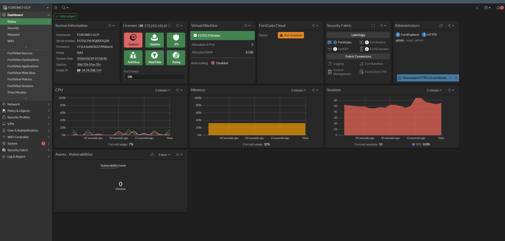

### Configuracion del tunel VPN-FULL

El tunel esta configurado como Full Tunnel — `IPv4 split tunnel` desactivado.
Esto fuerza que todo el trafico del cliente, incluyendo internet, pase
por FortiGate. El cliente recibe IP del rango `10.5.5.10–10.5.5.100`
con DNS `1.1.1.1`.

| Campo | Valor |
|---|---|
| Remote gateway | Dialup user |
| Interface | WAM-MGNT (port1) |
| Mode config | IPv4 |
| IP range clientes | 10.5.5.10 – 10.5.5.100 |
| DNS | 1.1.1.1 |
| IPv4 split tunnel | Desactivado (Full Tunnel) |
| Autenticacion | Pre-shared Key + EAP identity request |
| IKE | Version 2 |
| User group | Grupo-vpn |

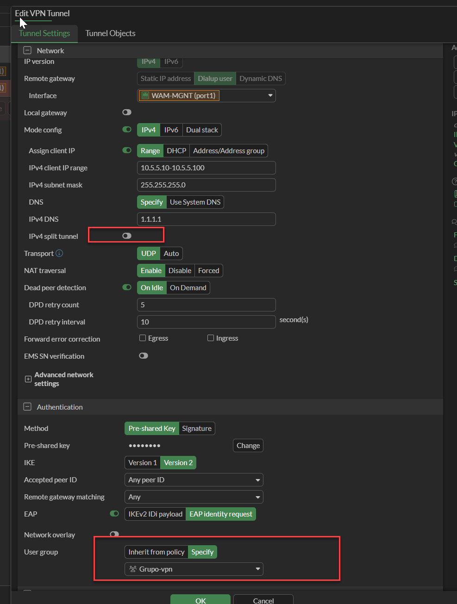

### Grupo de usuarios — Grupo-vpn

El grupo `Grupo-vpn` de tipo Firewall contiene al usuario `user1`.
Este grupo es referenciado directamente en la configuracion del tunel
para controlar que usuarios pueden conectarse.

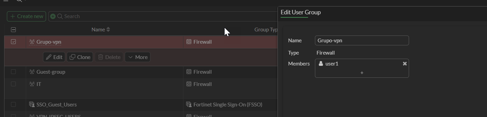

### Politica vpn-full (ID 5)

La politica `vpn-full` controla el trafico desde VPN-FULL hacia
WAM-MGNT (port1). Tiene Web Filter `custom` activo con SSL
deep-inspection, lo que permite inspeccionar trafico HTTPS
del cliente VPN. Servicios permitidos: HTTPS, HTTP, DNS.

| Campo | Valor |
|---|---|
| ID | 5 |
| Incoming interface | VPN-FULL |
| Outgoing interface | WAM-MGNT (port1) |
| Servicio | HTTPS, HTTP, DNS |
| Inspection mode | Flow-based |
| Web Filter | custom |
| SSL Inspection | deep-inspection |
| NAT | Habilitado |
| Hit count | 7,667 |
| Total bytes | 503.39 MB |

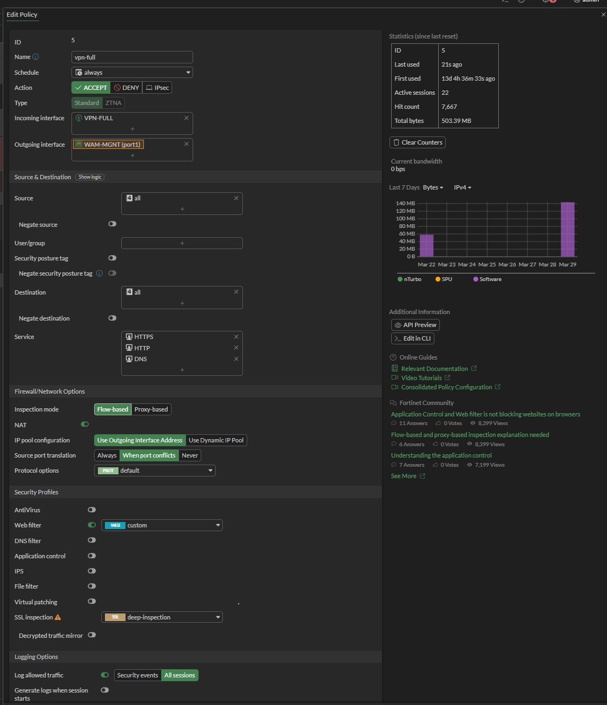

### Policy de acceso a dmz desde full tunel IPSec

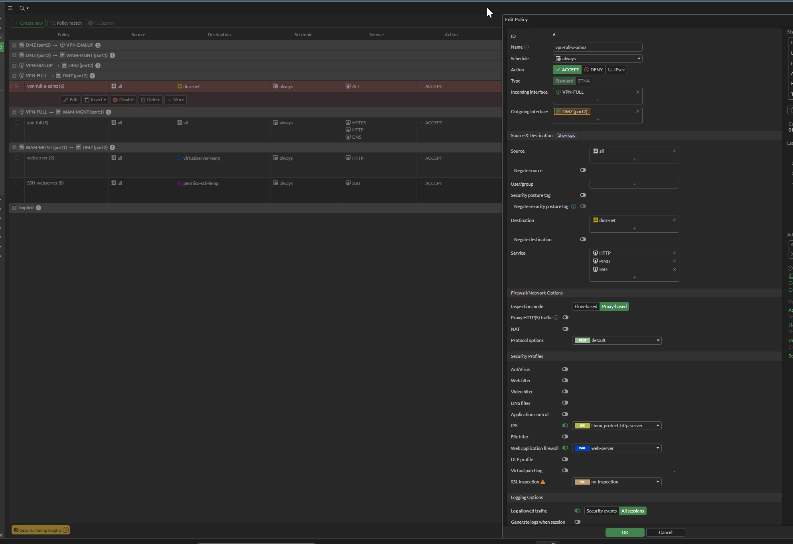

### VPN Tunnels — Estado

La vista VPN Tunnels muestra VPN-FULL activo con 1 conexion dialup
en WAM-MGNT (port1). VPN-DIALUP aparece inactivo — no hay clientes
conectados por split tunnel en este momento.

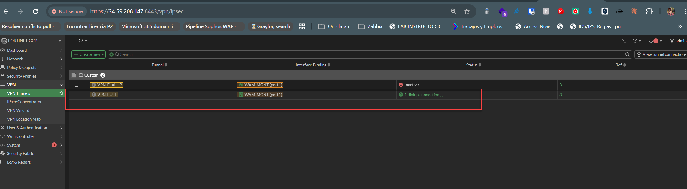

### IPsec Monitor — Sesion activa

El monitor IPsec confirma la sesion activa del cliente:

| Campo | Valor |
|---|---|
| Tunel | VPN-FULL_0 |
| Remote Gateway | 186.11.87.63 |
| Usuario | user1 |
| Bytes transferidos | 209.96 KB |
| Phase 1 | VPN-FULL_0 |
| Phase 2 Selector | v2VPN-FULL |

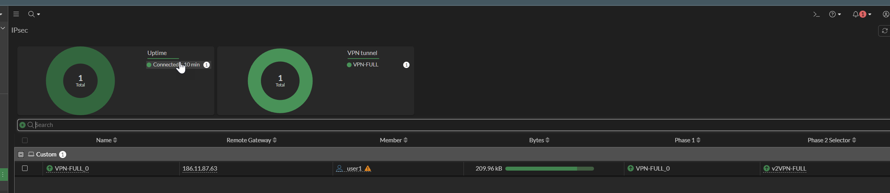

---

## Verificacion desde el cliente

### Conexion FortiClient

El cliente FortiClient Zero Trust Fabric Agent se conecta con el
perfil `vpn full` usando el usuario `user1`. Una vez conectado,
recibe la IP `10.5.5.10` del pool configurado en FortiGate.

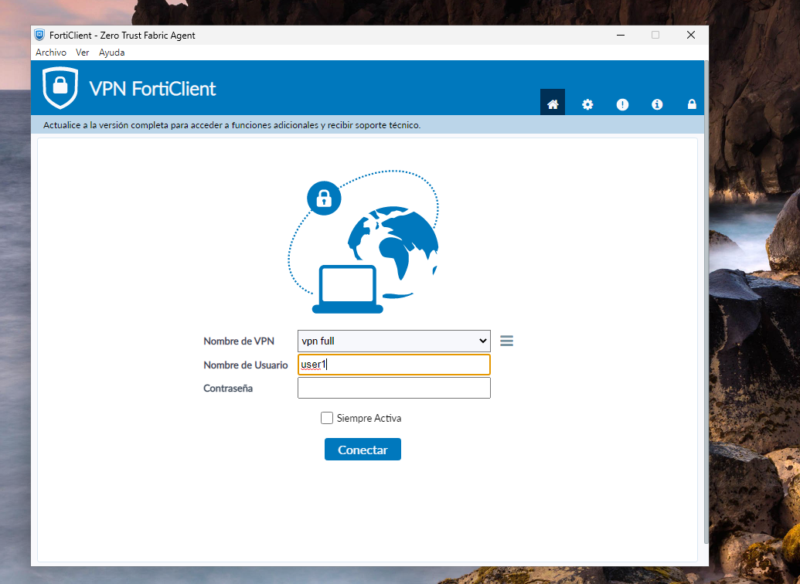

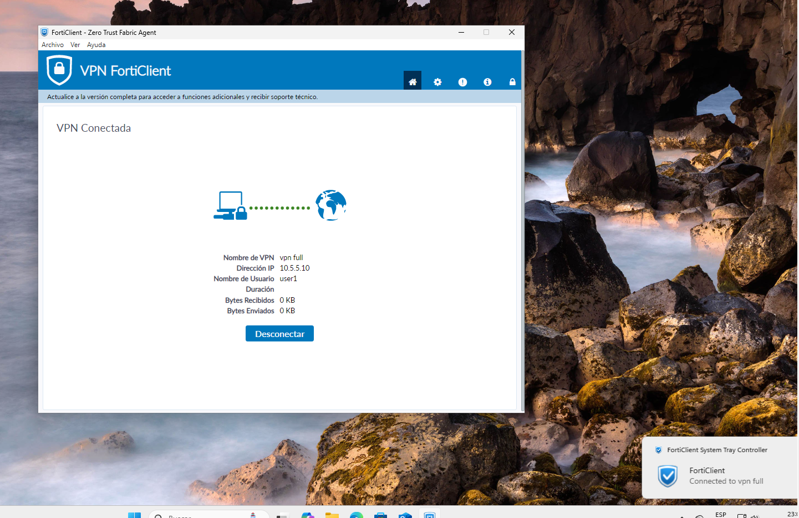

### Verificacion de IP publica

Con la VPN Full Tunnel activa, la IP publica del cliente cambia
a `34.59.208.147` — la IP de FortiGate en GCP. Esto confirma que
todo el trafico de internet sale por el tunel y no por la conexion
local del equipo.

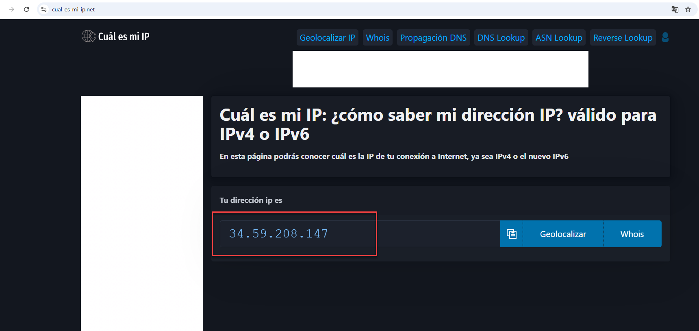

### Tracert hacia el servidor web

El tracert desde el cliente VPN hacia `10.20.0.10` muestra dos saltos:

| Salto | IP | Descripcion |
|---|---|---|
| 1 | 10.0.1.2 | FortiGate — NIC1 VPC WAN |
| 2 | 10.20.0.10 | Servidor web — VPC DMZ |

FortiGate es el unico gateway entre el cliente VPN y la DMZ.

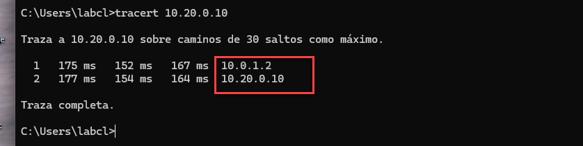

### Infraestructura GCP

La consola GCP confirma las dos VMs activas y sus interfaces.

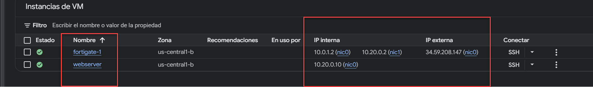

---

## Flujo de trafico completo
```
Equipo local (186.11.87.63)
    |
    | IPsec IKEv2 Full Tunnel
    v
FortiGate GCP (34.59.208.147 / 10.0.1.2)
    |
    | Web Filter custom + SSL deep-inspection
    v
Internet (trafico web del cliente)

Equipo local
    |
    | VPN → FortiGate → VPC DMZ
    v
Servidor web (10.20.0.10)
```

## Conclusion

La VPN Full Tunnel esta operativa. El cliente `user1` del grupo
`Grupo-vpn` se conecta via FortiClient, obtiene IP `10.5.5.10`
y todo su trafico sale por FortiGate en GCP. La politica `vpn-full`
aplica Web Filter `custom` con SSL deep-inspection sobre cada
sesion — base del control documentado en el Lab 3.2.