# Lab 3.2 — Web Filtering: Bloqueo por Categoria y Excepcion por URL

## Objetivo

Demostrar el control de navegacion web sobre usuarios conectados por VPN
Full Tunnel. El perfil Web Filter `custom` bloquea la categoria Social
Networking para el grupo `vpn_contabilidad`, con excepcion explicita para
x.com y sus dominios asociados. Todo el trafico es inspeccionado en modo
flow-based con SSL deep-inspection.

## Contexto

Este lab es la continuacion del Lab 3.1. El usuario `jsalazar` pertenece
al grupo `vpn_contabilidad` y se conecta por VPN Full Tunnel. Su trafico
web pasa obligatoriamente por FortiGate, que aplica el perfil Web Filter
`custom` definido en la politica `vpn-full` (ID 5).

La logica del lab:

- **facebook.com** e **instagram.com** — bloqueados por categoria Social Networking
- **x.com** — misma categoria Social Networking, pero tiene excepcion Exempt configurada — acceso permitido

## Infraestructura involucrada

| Componente | Detalle |
|---|---|
| Usuario | jsalazar, grupo vpn_contabilidad |
| IP asignada | 10.5.5.10 |
| Politica aplicada | vpn-full (ID 5) |
| Perfil Web Filter | custom — flow-based |
| SSL Inspection | deep-inspection |
| Categoria bloqueada | Social Networking |
| Excepcion activa | x.com, *.x.com, *.twimg.com — Exempt |

## Diagrama de arquitectura

---

## Configuracion FortiGate

### Grupo vpn_contabilidad

El grupo `vpn_contabilidad` de tipo Firewall contiene los usuarios
`jespinoza` y `jsalazar`. Este grupo es referenciado en la politica
`vpn-full` para aplicar controles diferenciados respecto a otros
grupos de usuarios VPN.

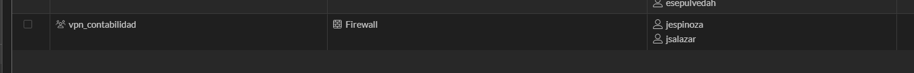

### Politica vpn-full (ID 5) — User/group

La politica `vpn-full` tiene el campo User/group configurado con
`vpn_contabilidad`. Esto significa que las reglas de Web Filter
`custom` se aplican especificamente a los usuarios de ese grupo
cuando navegan con VPN Full Tunnel activa.

| Campo | Valor |
|---|---|
| ID | 5 |
| Incoming interface | VPN-FULL |
| Outgoing interface | WAM-MGNT (port1) |
| User/group | vpn_contabilidad |
| Inspection mode | Flow-based |
| Web Filter | custom |
| SSL Inspection | deep-inspection |

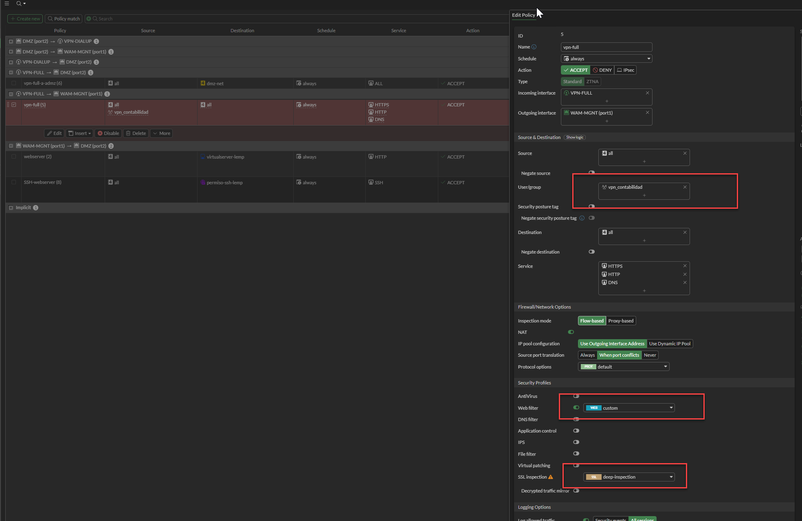

### Perfil Web Filter custom

El perfil `custom` opera en modo flow-based. Tiene habilitado el
FortiGuard Category Based Filter con las siguientes categorias
configuradas:

| Categoria | Accion |
|---|---|
| Sex Education | Block |
| Peer-to-peer File Sharing | Block |
| Internet Radio and TV | Warning (1 min) |
| Malicious Websites | Block |
| Phishing | Block |
| Social Networking | Block |

El Static URL Filter tiene 3 entradas activas, todas con accion
**Exempt** — esto significa que las URLs listadas omiten la
inspeccion de categoria y siempre se permiten:

| URL | Tipo | Accion | Estado |
|---|---|---|---|
| x.com | Simple | Exempt | Enable |
| *.x.com | Wildcard | Exempt | Enable |
| *.twimg.com | Wildcard | Exempt | Enable |

La excepcion `*.twimg.com` es necesaria porque x.com carga
imagenes y recursos desde ese CDN. Sin ella, la pagina se
bloquea parcialmente aunque el dominio principal este exento.

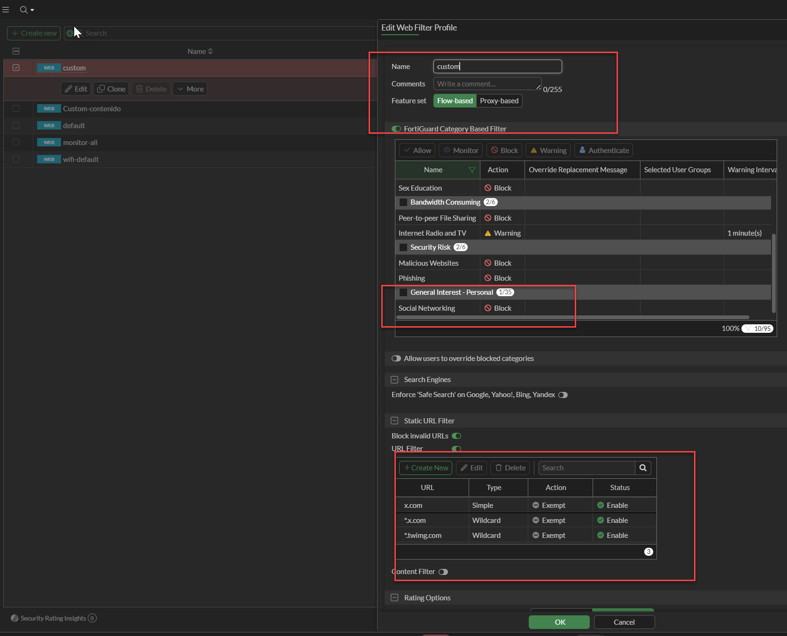

### Verificacion de categoria en FortiGuard

La consulta en FortiGuard Web Filter Lookup confirma que x.com
esta clasificado como **Social Networking** — la misma categoria
bloqueada en el perfil. La excepcion por URL es lo que permite
el acceso a pesar de la categoria.

| Campo | Valor |
|---|---|
| Dominio | x.com |
| Categoria | Social Networking |
| Grupo | General Interest - Personal |
| Risk Level | Low Risk |

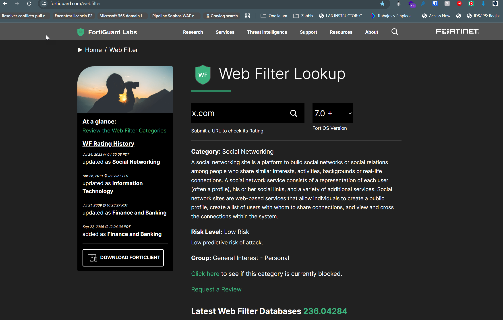

---

## Ejecucion del lab

### Conexion VPN — usuario jsalazar

El usuario `jsalazar` se conecta por VPN Full Tunnel con FortiClient.
Recibe IP `10.5.5.10` del pool configurado en FortiGate.

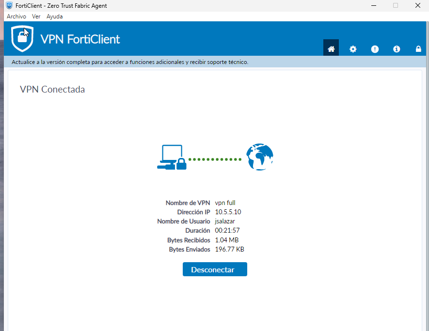

### Autenticacion en portal cautivo FortiGate

Al intentar navegar por primera vez, FortiGate redirige al usuario
al portal de autenticacion para identificar la sesion y aplicar
las politicas correspondientes al grupo `vpn_contabilidad`.

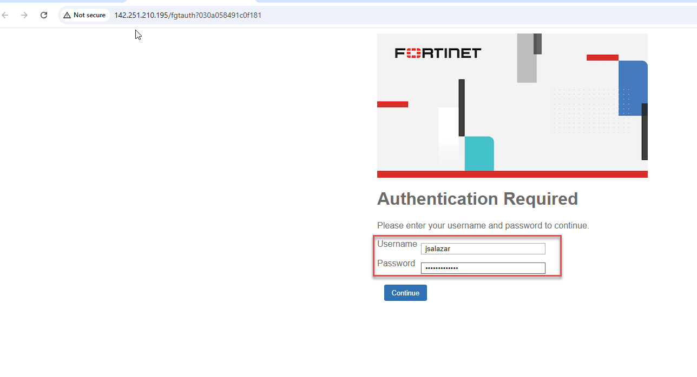

---

## Escenario 1 — Bloqueo por categoria: facebook.com

Al acceder a `facebook.com`, FortiGate intercepta la request e
identifica que el dominio pertenece a la categoria Social Networking,
que esta configurada con accion Block en el perfil `custom`.
El usuario recibe la pagina de bloqueo FortiGuard.

| Campo | Valor |
|---|---|
| URL | https://www.facebook.com/ |
| Categoria | Social Networking |
| Accion | Blocked |
| Motivo | Categoria bloqueada en perfil custom |

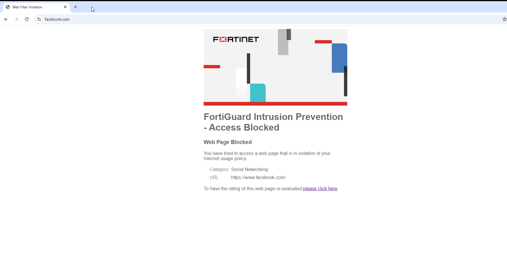

---

## Escenario 2 — Bloqueo por categoria: instagram.com

El mismo comportamiento se repite con `instagram.com`. Ambos dominios
pertenecen a la categoria Social Networking y no tienen excepcion
configurada en el Static URL Filter.

| Campo | Valor |
|---|---|
| URL | https://www.instagram.com/ |
| Categoria | Social Networking |
| Accion | Blocked |
| Motivo | Categoria bloqueada, sin excepcion URL |

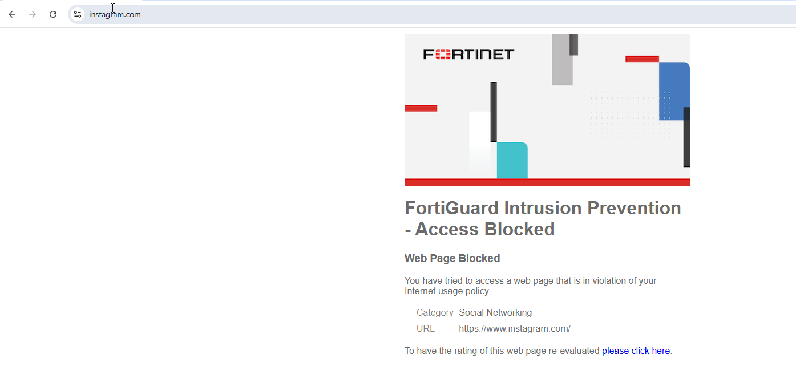

---

## Escenario 3 — Excepcion por URL: x.com

`x.com` pertenece a la misma categoria Social Networking, pero tiene
tres entradas en el Static URL Filter con accion **Exempt**: `x.com`,
`*.x.com` y `*.twimg.com`. El acceso es permitido — FortiGate omite
la evaluacion de categoria para estos dominios.

| Campo | Valor |
|---|---|
| URL | https://x.com/home |
| Categoria | Social Networking |
| Accion | Passthrough (Exempt) |
| Motivo | Excepcion explicita en Static URL Filter |

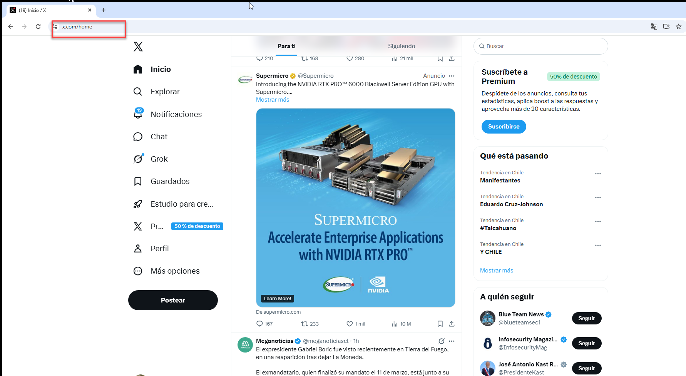

---

## Evidencia en FortiGate

### Security Events — Resumen Web Filter

El panel Security Events muestra 415 eventos totales. El resumen
del modulo Web Filter confirma el resultado del lab:

| Categoria | Accion | Eventos |
|---|---|---|
| Social Networking | Blocked | 119 |
| URL filter applied | Passthrough | 77 |
| Unrated | Blocked | 6 |
| Potentially Unwanted Program | Blocked | 4 |
| Travel | Blocked | 4 |

Los 77 eventos Passthrough con tipo URL filter applied corresponden
al trafico de x.com y twimg.com permitido por las excepciones.

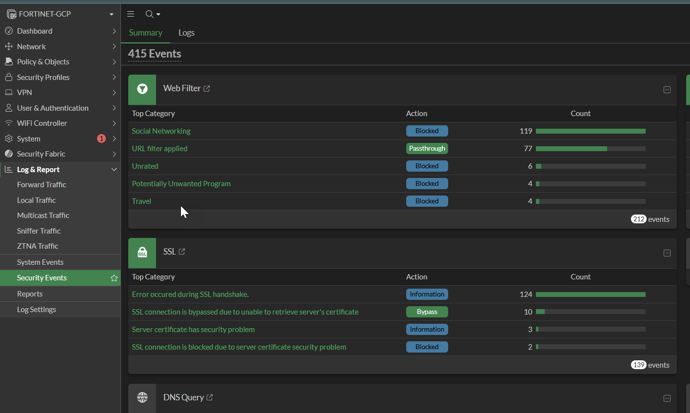

### Logs Web Filter — Bloqueos Social Networking

Filtro: `Category == Social Networking` + `Action == blocked`.
Todos los eventos corresponden al usuario `jsalazar` desde
IP `10.5.5.10`. Se registran accesos a facebook.com e instagram.com
con accion Blocked.

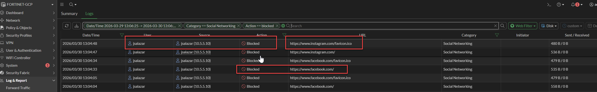

### Logs Web Filter — Passthrough x.com

Filtro: `Event Type == urlfilter` + `Action == passthrough`.
Todos los eventos son del usuario `jsalazar` desde IP `10.5.5.10`.
Se registran accesos a x.com, twimg.com y dominios asociados con
accion Passthrough — la excepcion URL esta funcionando correctamente.

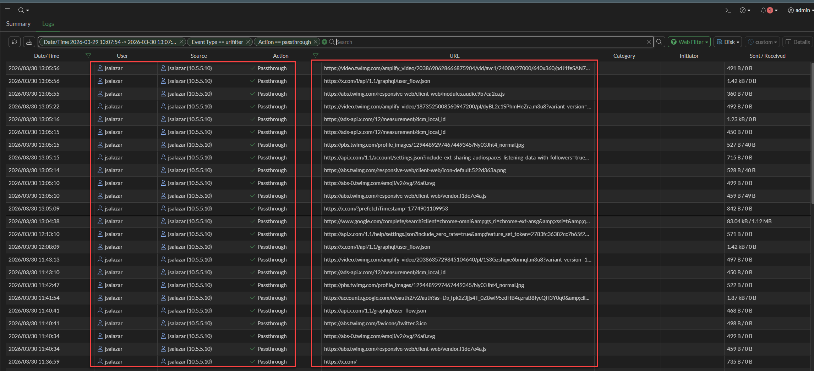

---

## Analisis

La categoria Social Networking esta bloqueada para el grupo
`vpn_contabilidad`. facebook.com e instagram.com caen en esa
categoria y no tienen excepcion — bloqueados. x.com cae en la
misma categoria pero tiene tres entradas Exempt en el Static URL
Filter — permitido.

Puntos relevantes:

- El modo flow-based es suficiente para Web Filtering con SSL
  deep-inspection — no requiere proxy-based para este caso
- La excepcion incluye `*.twimg.com` ademas de `x.com` porque
  el contenido multimedia de x.com se sirve desde ese CDN.
  Sin esa entrada, la pagina cargaria en blanco o parcialmente
- El usuario `jsalazar` esta identificado en los logs — FortiGate
  vincula la IP 10.5.5.10 con el usuario autenticado via portal
  cautivo. Esto es relevante para forensics y cumplimiento
- Los 77 eventos Passthrough confirman que x.com tiene trafico
  real activo — no es solo un bloqueo teorico

## Conclusion

El perfil Web Filter `custom` en modo flow-based bloquea Social
Networking para el grupo `vpn_contabilidad`, con excepcion
funcional para x.com y sus dominios CDN. El control es efectivo
y granular: misma categoria, distinto resultado segun la regla
URL que aplique primero. Los logs identifican al usuario,
la URL, la categoria y la accion — base suficiente para
auditoria y cumplimiento en entornos regulados.