# Lab 3.3 — File Filter y DLP: Control de Archivos y Datos Sensibles

## Objetivo

Demostrar dos controles de seguridad aplicados sobre usuarios VPN del
grupo IT en modo proxy-based: bloqueo de descargas por tipo de archivo
(.exe) y prevencion de fuga de datos con numeros de tarjeta de credito.
Ambos controles operan sobre la politica `DLP & File (9)` con
SSL deep-inspection activo.

## Contexto

El usuario `user2` pertenece al grupo `IT` y se conecta por VPN Full
Tunnel. Su trafico pasa por la politica `DLP & File (9)`, diferente
a la politica `vpn-full (5)` del grupo `vpn_contabilidad`.
Mismo tunel VPN, distintas politicas, distintos controles.

| Grupo | Politica | Controles |
|---|---|---|
| vpn_contabilidad | vpn-full (5) | Web Filter custom + SSL deep-inspection |
| IT | DLP & File (9) | File Filter Prohibido + DLP dlp-credit-card + SSL deep-inspection |

## Mapeo MITRE ATT&CK

| Tactica | Tecnica | ID |
|---|---|---|
| Exfiltration | Exfiltration Over Web Service | T1567 |
| Collection | Data from Local System | T1005 |

## Infraestructura involucrada

| Componente | Detalle |
|---|---|
| Usuario | user2, grupo IT |
| IP asignada | 10.5.5.10 |
| Politica aplicada | DLP & File (9) |
| Inspection mode | Proxy-based |
| File Filter | Prohibido |
| DLP Profile | dlp-credit-card |
| SSL Inspection | deep-inspection |

## Diagrama de arquitectura

---

## Configuracion FortiGate

### Grupo IT

El grupo IT de tipo Firewall contiene al usuario user2.
Este grupo es referenciado en la politica DLP & File (9).

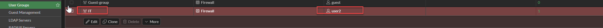

### Comparativa de politicas por grupo

Las dos politicas VPN activas aplican controles distintos segun
el grupo de usuario. DLP & File (9) requiere proxy-based para
poder inspeccionar el contenido de archivos y mensajes.

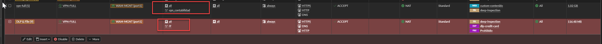

### Politica DLP & File (ID 9)

| Campo | Valor |
|---|---|
| ID | 9 |
| Nombre | DLP & File |
| Incoming interface | VPN-FULL |
| Outgoing interface | WAM-MGNT (port1) |
| User/group | IT |
| Servicio | HTTPS, DNS, HTTP |
| Inspection mode | Proxy-based |
| File Filter | Prohibido |
| DLP Profile | dlp-credit-card |
| SSL Inspection | deep-inspection |

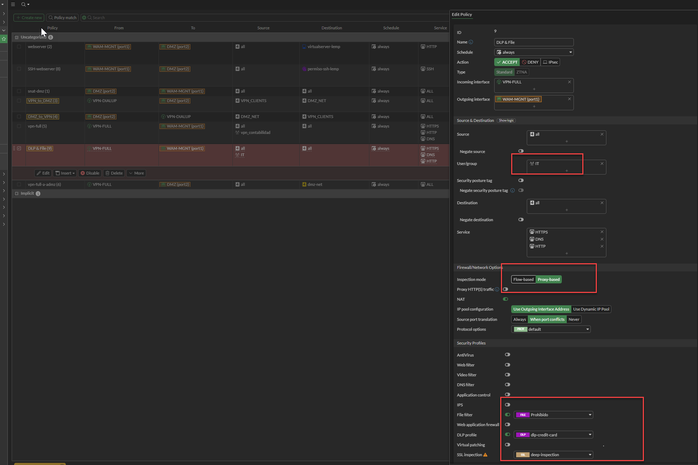

### Perfil File Filter — Prohibido

El perfil tiene dos reglas con comportamientos distintos:

| Regla | Trafico | Protocolos | Tipos | Accion |
|---|---|---|---|---|
| bloquear archivo exe | Incoming | HTTP, FTP +4 | exe | Block |
| Prohibido | Incoming | CIFS, FTP +6 | pdf, rar, zip | Monitor |

Block interrumpe la descarga y retorna pagina de bloqueo.
Monitor registra el evento sin interrumpir.

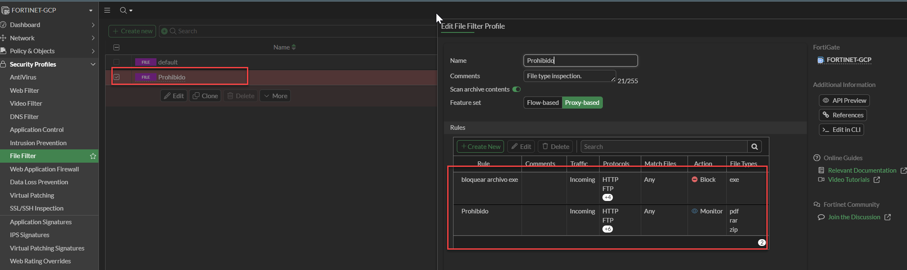

---

## Configuracion DLP — Detalle

La cadena de configuracion DLP sigue cuatro niveles:
**Diccionario → Sensor → Regla → Perfil**

### Diccionario — credit-card-dict

El diccionario define el patron de busqueda mediante una
expresion regular. Detecta numeros de tarjeta de 16 digitos
con separadores opcionales (guion o espacio).

| Campo | Valor |
|---|---|
| Nombre | credit-card-dict |
| Tipo entrada | regex |
| Pattern | `\b(?:\d{4}[- ]?){3}\d{4}\b` |
| Logical relationship | Any entries |
| Detect repeated matches | As one match |

El patron `\b(?:\d{4}[- ]?){3}\d{4}\b` detecta formatos como:
`6253-4324-5544-3422`, `6253 4324 5544 3422` o `6253432455443422`.

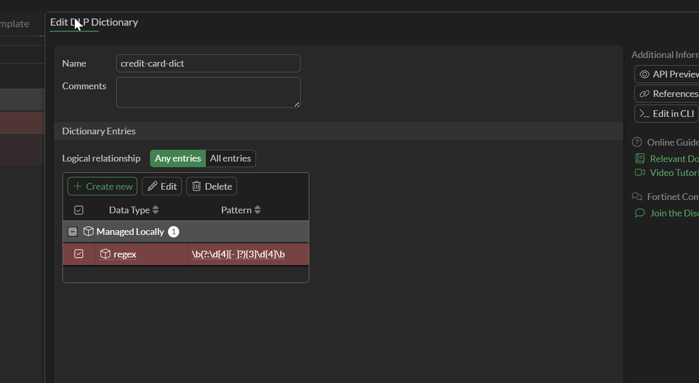

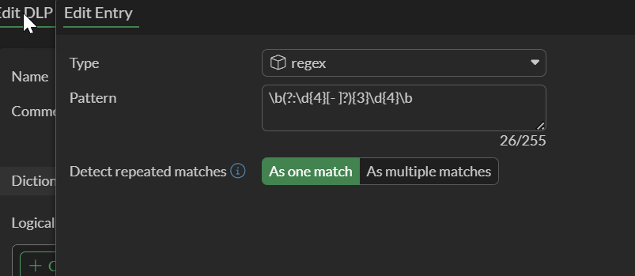

### Sensor — rule-cc

El sensor referencia el diccionario y define cuantas
coincidencias se necesitan para disparar la regla.

| Campo | Valor |
|---|---|
| Nombre | rule-cc |
| Diccionario | credit-card-dict |
| Matches required | 1 |
| Match criteria | Any entries |

Con `Matches required = 1`, una sola ocurrencia del patron
en el trafico es suficiente para activar el bloqueo.

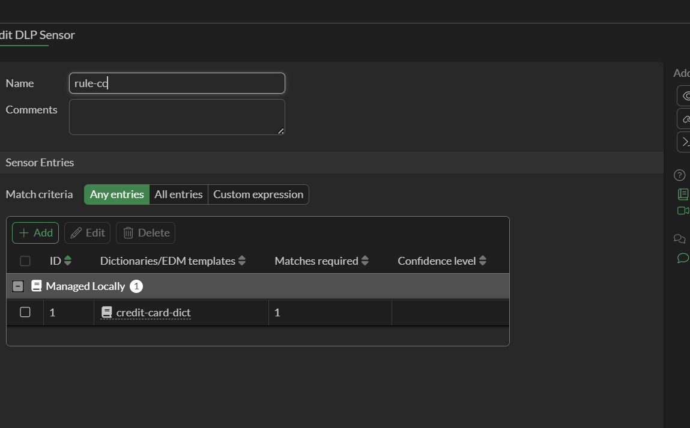

### Regla — sensor-credit-card

La regla define la accion, la severidad y los protocolos
a inspeccionar cuando el sensor detecta una coincidencia.

| Campo | Valor |
|---|---|
| Nombre | sensor-credit-card |
| Tipo | Sensor |
| Sensor | rule-cc |
| Severity | High |
| Action | Block |
| Match type | Message |
| Protocolos | SMTP, POP3, IMAP, HTTP-POST |

HTTP-POST es el protocolo que cubre el envio de emails
via webmail (Gmail, Outlook Web). SMTP, POP3 e IMAP
cubren clientes de correo tradicionales.

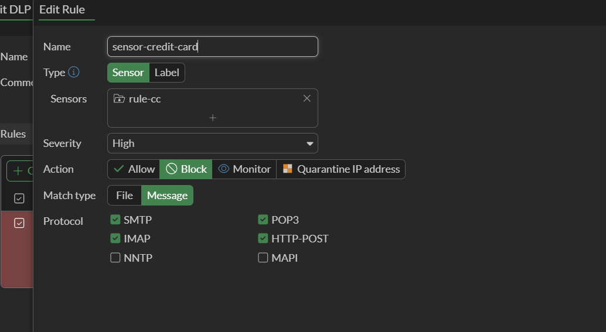

### Perfil DLP — dlp-credit-card

El perfil agrupa las reglas y es el objeto que se
referencia en la politica de firewall.

| Campo | Valor |
|---|---|
| Nombre | dlp-credit-card |
| Regla | sensor-credit-card |
| Tipo | sensor |
| Protocolos | SMTP, POP3, IMAP, HTTP-POST |
| Match type | Message |
| Accion | Block |

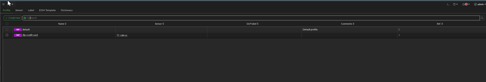

---

## Ejecucion del lab

### Conexion VPN — usuario user2

user2 se conecta por VPN Full Tunnel. Recibe IP 10.5.5.10.
Al navegar, FortiGate redirige al portal de autenticacion
para vincular la sesion al grupo IT.

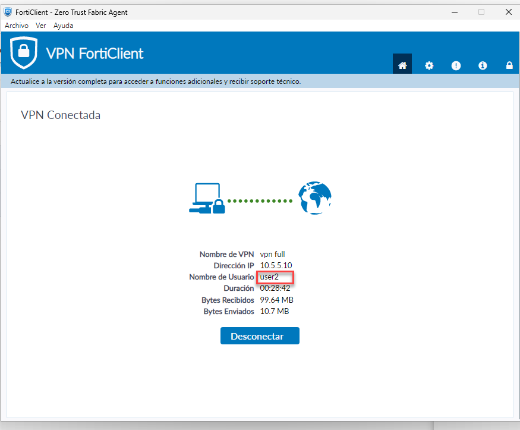

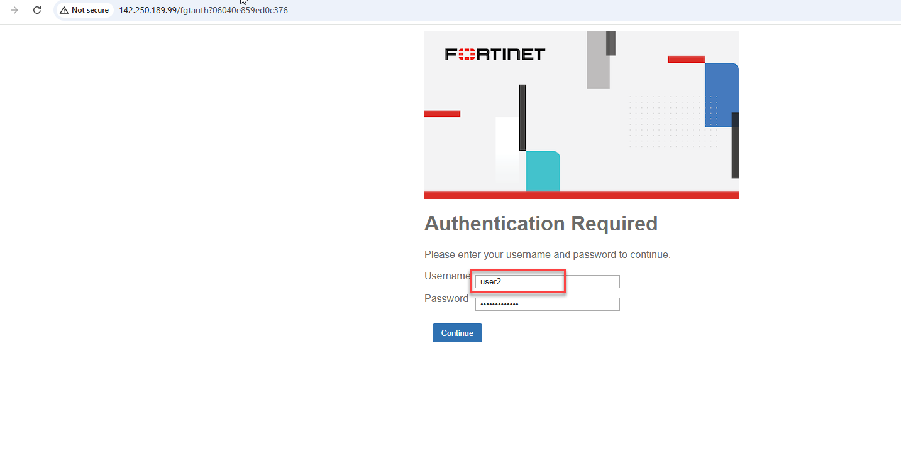

---

## Escenario 1 — File Filter: Bloqueo de ejecutable (.exe)

user2 intenta descargar `WinRAR-720.exe` desde win-rar.com.
FortiGate intercepta la descarga, identifica el tipo exe e
interrumpe la transferencia. La regla `bloquear archivo exe`
aplica accion Block.

| Campo | Valor |
|---|---|
| Archivo | WinRAR-720.exe |
| URL | https://www.win-rar.com/fileadmin/winrar-versions/downloader/WinRAR-720.exe |
| Accion | Blocked |
| Motivo | File type .exe bloqueado por regla bloquear archivo exe |

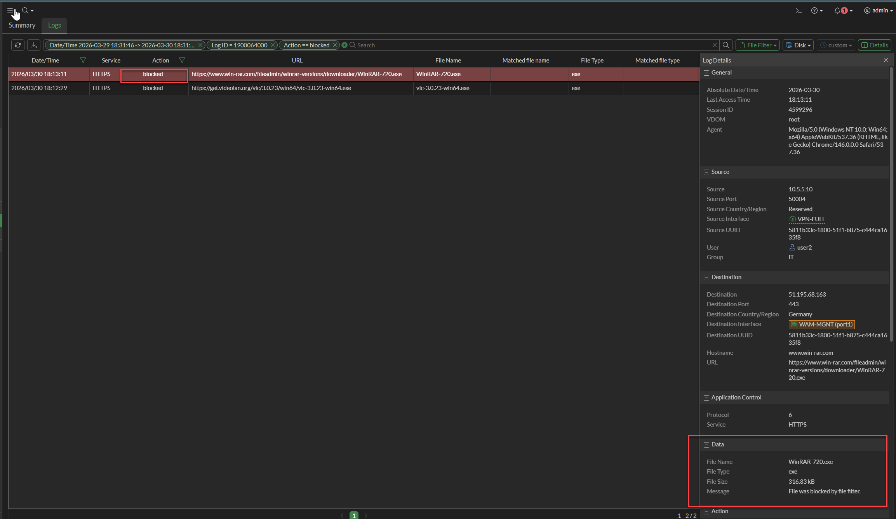

### Log File Filter — Blocked exe

| Archivo | URL | Tipo | Accion |
|---|---|---|---|
| WinRAR-720.exe | win-rar.com | exe | blocked |
| vlc-3.0.23-win64.exe | get.videolan.org | exe | blocked |

| Campo | Valor |
|---|---|
| Source | 10.5.5.10 |
| Source Interface | VPN-FULL |
| Destination | 51.195.68.163 (Alemania) |
| User / Group | user2 / IT |
| File Name | WinRAR-720.exe |
| File Type | exe |
| File Size | 316.83 kB |
| Rule Name | bloquear archivo exe |
| Profile | Prohibido |
| Policy ID | DLP & File (9) |
| Message | File was blocked by file filter |

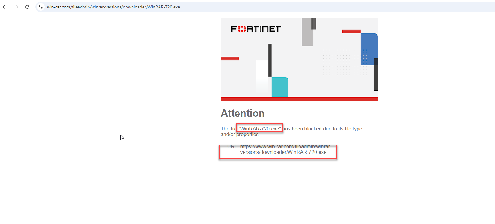

---

## Escenario 2 — File Filter: Deteccion de PDF (log-only)

user2 descarga `media.pdf` desde media.adeo.com.
La regla `Prohibido` tiene accion Monitor para pdf —
el archivo se descarga normalmente pero queda registrado.

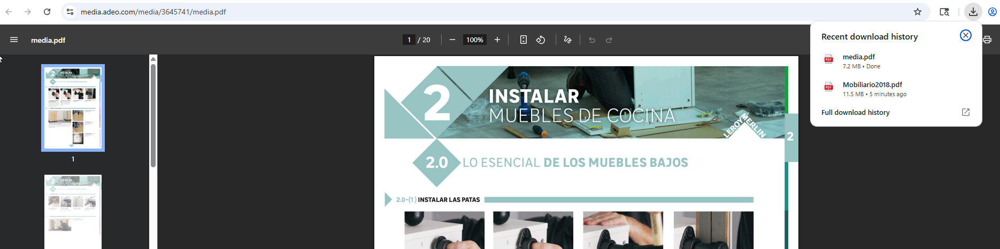

### Log File Filter — Log-only pdf

| Campo | Valor |
|---|---|
| File Name | media.pdf |
| File Type | pdf |
| File Size | 7.51 MB |
| Action | log-only |
| Rule Name | Prohibido |
| Profile | Prohibido |
| Policy ID | DLP & File (9) |
| Direction | incoming |
| Message | File was detected by file filter |
| Security Level | Notice |

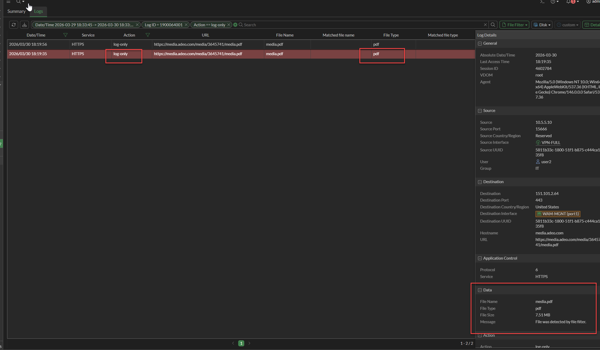

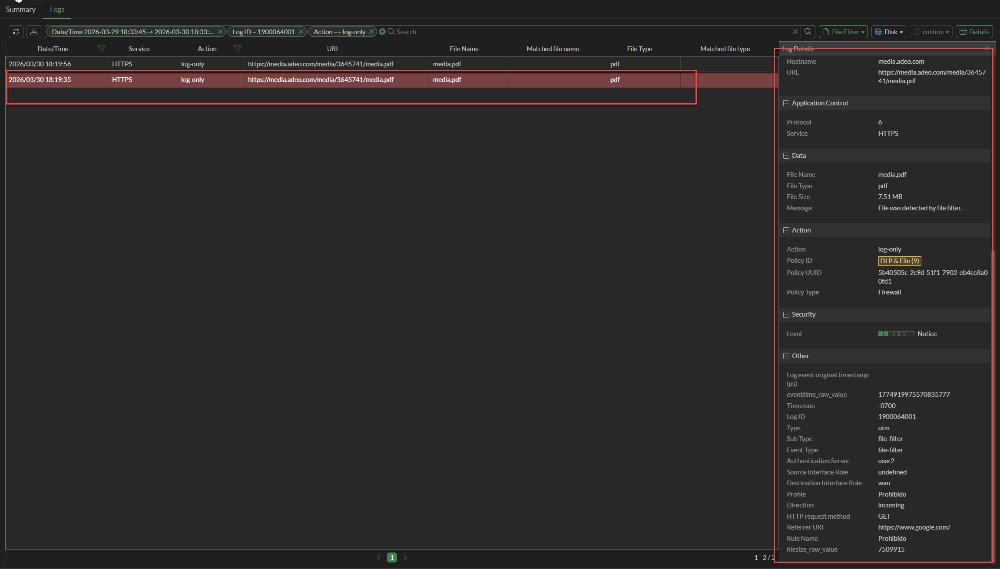

---

## Escenario 3 — DLP: Bloqueo de numero de tarjeta de credito

user2 intenta enviar un email desde Gmail con el numero
`6253-4324-5544-3422` en el cuerpo. FortiGate inspecciona
el trafico HTTPS saliente en modo proxy, detecta el patron
mediante el sensor `rule-cc` y bloquea el envio.
Gmail muestra: `Message could not be sent`.

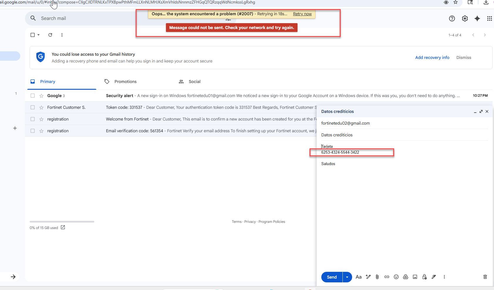

### Log DLP — Overview

34 eventos DLP block para user2 hacia mail.google.com.

| Campo | Valor |
|---|---|
| Usuario | user2 |
| Source | 10.5.5.10 (VPN-FULL) |
| Destination | 142.250.189.101 |
| Hostname | mail.google.com |
| Group | IT |
| Accion | block |
| Sensor | rule-cc matching credit-card |

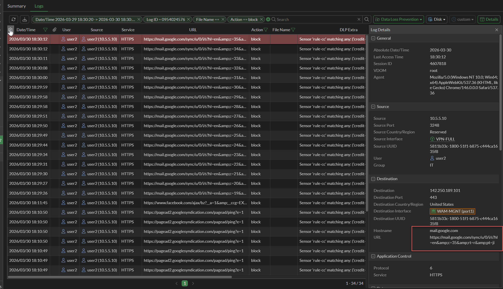

### Detalle log DLP

| Campo | Valor |
|---|---|
| DLP Profile | dlp-credit-card |
| Filter Type | sensor |
| Filter Category | message |
| DLP Extra | Sensor rule-cc matching: credit-card-dict >= 1; match |
| Direction | outgoing |
| Severity | High |
| Rule Name | sensor-credit-card |
| Event Type | dlp |
| HTTP Method | POST |
| Policy ID | DLP & File (9) |
| Security Level | Warning |

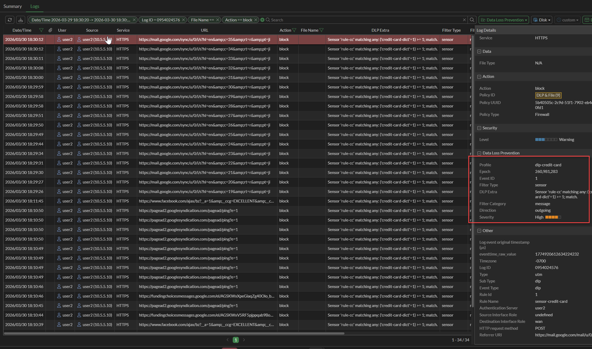

---

## Resumen — Security Events

| Modulo | Categoria | Accion | Eventos |
|---|---|---|---|
| Data Loss Prevention | Data loss by DLP sensor rule | Block | 29 |
| File Filter | File was blocked by file filter | Blocked | 2 |
| File Filter | File was detected by file filter | Log Only | 2 |

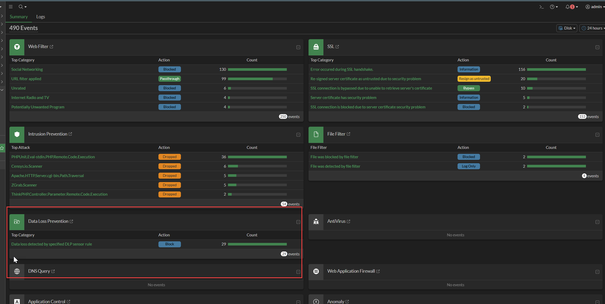

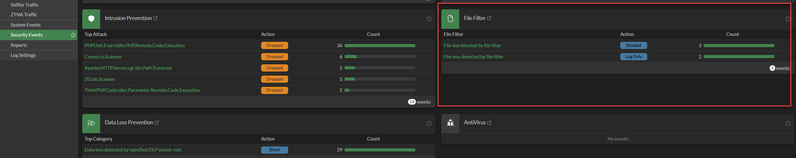

---

## Analisis

**Cadena DLP — como funciona:**
El patron regex `\b(?:\d{4}[- ]?){3}\d{4}\b` en el diccionario
`credit-card-dict` detecta cualquier secuencia de 16 digitos
con separadores opcionales. El sensor `rule-cc` necesita
solo 1 coincidencia para activarse. La regla `sensor-credit-card`
aplica accion Block sobre HTTP-POST — el protocolo que usa
Gmail para enviar mensajes via HTTPS.

**Por que proxy-based:**
File Filter y DLP requieren proxy-based porque necesitan
reconstruir el contenido completo antes de inspeccionarlo.
En flow-based no es posible determinar el tipo de archivo
ni detectar patrones dentro de trafico HTTPS cifrado.

**Block vs log-only en File Filter:**
La regla `bloquear archivo exe` bloquea — el archivo nunca
llega al cliente. La regla `Prohibido` solo registra — el
archivo se entrega. Util para auditoria sin impactar operacion.

**Segmentacion por grupo:**
user2 (IT) cae en DLP & File (9).
jsalazar (vpn_contabilidad) cae en vpn-full (5).
Mismo tunel, distinta politica, distintos controles.

## Conclusion

La politica DLP & File (9) en modo proxy-based demostro
tres controles sobre el mismo usuario: bloqueo de ejecutables,
registro de PDFs y prevencion de exfiltracion de datos de
tarjeta de credito. Los tres quedaron registrados con usuario,
IP, archivo o dato detectado y regla aplicada — base suficiente
para auditoria y cumplimiento en entornos regulados financieros.